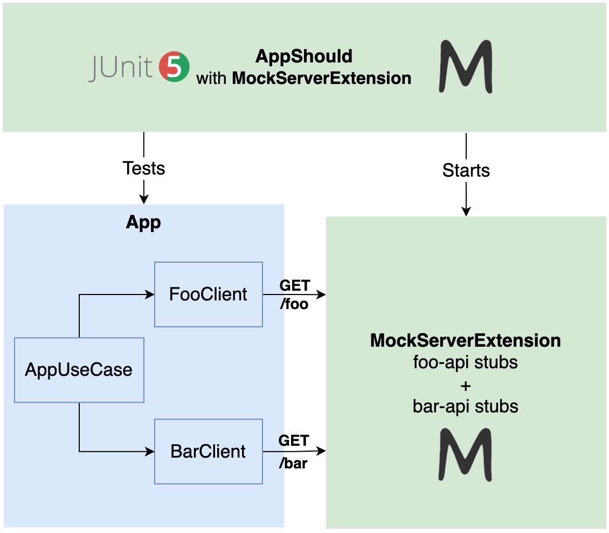
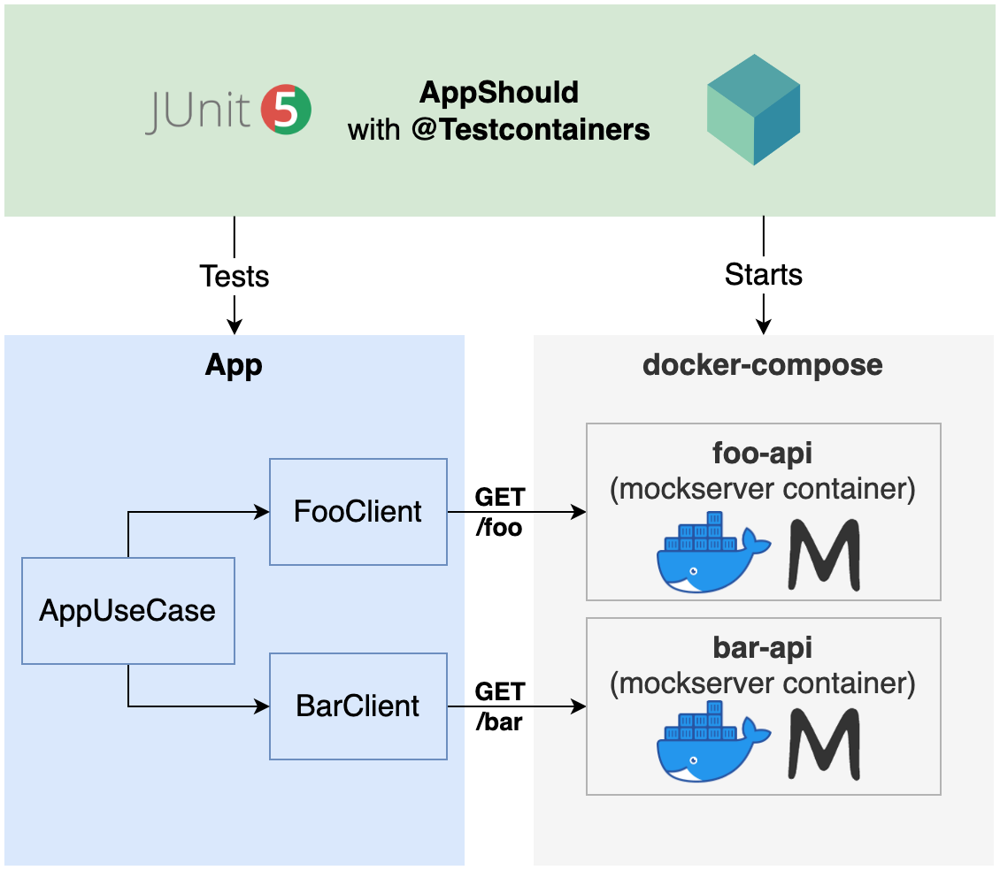
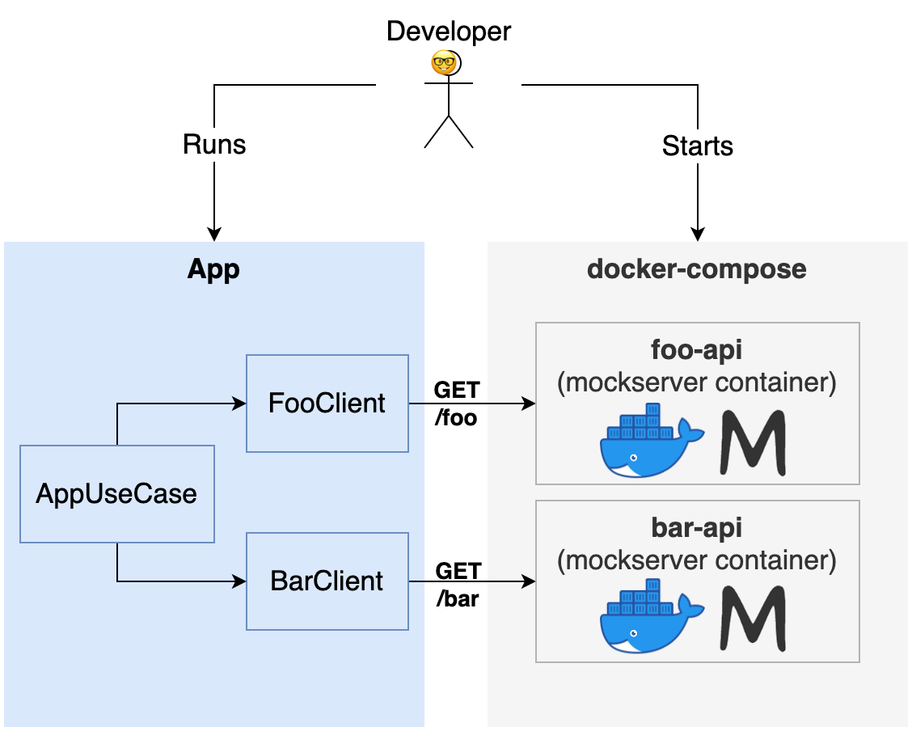

[](https://github.com/rogervinas/mockserver-testing/actions/workflows/gradle.yml)


>>>>>>> Stashed changes

# MockServer Testing

I've just found out [MockServer](https://mock-server.com/) and it looks awesome 🤩 so I wanted to check it out repeating the steps of my previous demo [WireMock Testing](https://github.com/rogervinas/wiremock-testing) which (as you can expect) uses [WireMock](https://wiremock.org/), another fantastic tool to mock APIs.

So in this demo we will use first [MockServer JUnit5 extension](https://mock-server.com/mock_server/running_mock_server.html#junit_test_extension):



And then we will use [MockServer Docker image](https://mock-server.com/mock_server/running_mock_server.html#docker_container) and [Testcontainers](https://www.testcontainers.org/):



* [BarClient](#barclient)
  * [BarClient interface](#barclient-interface)
  * [BarKtorClient test](#barktorclient-test)
  * [BarKtorClient implementation](#barktorclient-implementation)
* [FooClient](#fooclient)
  * [FooClient interface](#fooclient-interface)
  * [FooKtorClient test](#fooktorclient-test)
  * [FooKtorClient implementation](#fooktorclient-implementation)
* [AppUseCase](#appusecase)
* [App](#app)
  * [App implementation](#app-implementation)
  * [App test with MockServerExtension](#app-test-with-mockserverextension)
  * [App test with two MockServers](#app-test-with-two-mockservers)
  * [App test with MockServer Docker](#app-test-with-mockserver-docker)
    * [Static stubs](#static-stubs)
    * [Dynamic stubs](#dynamic-stubs)
  * [App run with MockServer Docker](#app-run-with-mockserver-docker)
* [Test this demo](#test-this-demo)
* [Run this demo](#run-this-demo)

## BarClient

### BarClient interface

```kotlin
interface BarClient {

  fun call(name: String): String
}
```

### BarKtorClient test

I will use a [Ktor client](https://ktor.io/docs/client.html) for no other reason that I need an Http client and this seems interesting, as we are using **Kotlin**.

So a simple test with **MockServerExtension** for the **BarKtorClient** looks like:

```kotlin
@ExtendWith(MockServerExtension::class)
@TestInstance(PER_CLASS)
class BarKtorClientShould {

  private val name = "Sue"

  private lateinit var mockServerClient: MockServerClient
  private lateinit var mockServerUrl: String

  @BeforeAll
  fun beforeAll(mockServerClient: MockServerClient) {
    this.mockServerClient = mockServerClient
    this.mockServerUrl = "http://localhost:${mockServerClient.port}"
  }

  @BeforeEach
  fun beforeEach() {
    mockServerClient.reset()
  }

  @Test
  fun `call bar api`() {
    mockServerClient
      .`when`(request().withMethod("GET").withPath("/bar/${name}"))
      .respond(response().withStatusCode(200).withBody("Hello $name I am Bar!"))

    assertThat(BarKtorClient(mockServerUrl).call(name))
      .isEqualTo("Hello $name I am Bar!")
  }

  @Test
  fun `handle bar api server error`() {
    mockServerClient
      .`when`(request().withMethod("GET").withPath("/bar/.+"))
      .respond(response().withStatusCode(503))

    assertThat(BarKtorClient(mockServerUrl).call(name))
      .startsWith("Bar api error: Server error")
  }
}
```

Note that we can inject **MockServerClient** as a parameter in the test methods too.

### BarKtorClient implementation

In order to make the test pass 🟩 we can implement the **BarKtorClient** this way:

```kotlin
class BarKtorClient(private val url: String) : BarClient {

  private val client = HttpClient(CIO)

  override fun call(name: String): String = runBlocking {
    try {
      client.get("$url/bar/$name")
    } catch (e: Exception) {
      "Bar api error: ${e.message}"
    }
  }
}
```

## FooClient

### FooClient interface

```kotlin
interface FooClient {
  
  fun call(name: String): String
}
```

### FooKtorClient test

For this test we will use [MockServer's Mustache templates](https://mock-server.com/mock_server/response_templates.html#mustache_templates):

```kotlin
@TestInstance(PER_CLASS)
class FooKtorClientShould {

  private val name = "Joe"

  private lateinit var mockServerClient: MockServerClient
  private lateinit var mockServerUrl: String

  @BeforeAll
  fun beforeAll() {
    mockServerClient = ClientAndServer()
    mockServerUrl = "http://localhost:${mockServerClient.port}"
  }

  @BeforeEach
  fun beforeEach() {
    mockServerClient.reset()
  }

  @Test
  fun `call foo api`() {
    mockServerClient
      .`when`(request().withMethod("GET").withPath("/foo").withQueryStringParameter("name", ".+"))
      .respond(template(
        MUSTACHE,
        """
        {
          statusCode: 200,
          body: 'Hello {{ request.queryStringParameters.name.0 }} I am Foo!'
        }
        """.trimIndent()
      ))

    assertThat(FooKtorClient(mockServerUrl).call(name)).isEqualTo("Hello $name I am Foo!")
  }

  @Test
  fun `handle foo api server error`() {
    mockServerClient
      .`when`(request().withMethod("GET").withPath("/foo").withQueryStringParameter("name", ".+"))
      .respond(response().withStatusCode(503))

    assertThat(FooKtorClient(mockServerUrl).call(name)).startsWith("Foo api error: Server error")
  }
}
```

Note that:
* As in the previous test we can inject **MockServerClient** as a parameter in the test methods too.
* **MockServer** provides also [Velocity](https://mock-server.com/mock_server/response_templates.html#velocity_templates) and [Javascript](https://mock-server.com/mock_server/response_templates.html#javascript_templates) templates that support more complex logic.

### FooKtorClient implementation

Same as before in order to make the test pass 🟩 we can implement the **FooKtorClient** this way:

```kotlin
class FooKtorClient(private val url: String) : FooClient {

  private val client = HttpClient(CIO)

  override fun call(name: String): String = runBlocking {
    try {
      client.get("$url/foo") {
        parameter("name", name)
      }
    } catch (e: Exception) {
      "Foo api error: ${e.message}"
    }
  }
}
```

## AppUseCase

Now we have to implement **AppUseCase**, which will use a **FooClient** to call the **Foo API** and then a **BarClient** to call the **Bar API**. 

As it is not **MockServer** related because we can test first the implementation just using [MockK JUnit5 extension](https://mockk.io/#junit5) we can skip the details and you can review the source code of [AppUseCaseShould](src/test/kotlin/com/rogervinas/mockserver/AppUseCaseShould.kt) and [AppUseCase](src/main/kotlin/com/rogervinas/mockserver/AppUseCase.kt).

## App

### App implementation

Let me introduce first the **App** implementation, as I will present later two different types of **MockServer** tests:

```kotlin
class App(
  private val name: String,
  private val fooApiUrl: String,
  private val barApiUrl: String
) {

  fun execute() = AppUseCase().execute(
    name,
    FooKtorClient(fooApiUrl),
    BarKtorClient(barApiUrl)
  )
}
```

### App test with MockServerExtension

Since in this example **Foo API** and **Bar API** <u>do not have conflicting endpoints</u>, we can use **MockServerExtension** to mock both APIs:

```kotlin
@ExtendWith(MockServerExtension::class)
class AppShouldWithOneMockServer {

  private val name = "Ada"

  @Test
  fun `call foo and bar`(mockServerClient: MockServerClient) {
    mockServerClient
      .`when`(request().withMethod("GET").withPath("/foo").withQueryStringParameter("name", name))
      .respond(response().withStatusCode(200).withBody("Hello ${name} I am Foo!"))
    mockServerClient
      .`when`(request().withMethod("GET").withPath("/bar/${name}"))
      .respond(response().withStatusCode(200).withBody("Hello $name I am Bar!"))

    val mockServerUrl = "http://localhost:${mockServerClient.port}"
    val app = App(name, mockServerUrl, mockServerUrl)

    assertThat(app.execute()).isEqualTo(
      """
        Hi! I am $name
        I called Foo and its response is Hello $name I am Foo!
        I called Bar and its response is Hello $name I am Bar!
        Bye!
      """.trimIndent()
    )
  }
}
```

### App test with two MockServers

But imagine a real scenario where **Foo API** and **Bar API** <u>do have conflicting endpoints</u>, or you just want to <u>mock them separatedly for any reason</u>. In this case you can use two **MockServers** instead of using **MockServerExtension**:

```kotlin
@TestInstance(PER_CLASS)
class AppShouldWithTwoMockServers {

  private val name = "Leo"

  private val mockServerClientFoo = ClientAndServer()
  private val mockServerClientBar = ClientAndServer()

  @Test
  fun `call foo and bar`() {
    mockServerClientFoo
      .`when`(request().withMethod("GET").withPath("/foo").withQueryStringParameter("name", name))
      .respond(response().withStatusCode(200).withBody("Hello ${name} I am Foo!"))
    mockServerClientBar
      .`when`(request().withMethod("GET").withPath("/bar/${name}"))
      .respond(response().withStatusCode(200).withBody("Hello $name I am Bar!"))

    val mockServerFooUrl = "http://localhost:${mockServerClientFoo.port}"
    val mockServerBarUrl = "http://localhost:${mockServerClientBar.port}"
    val app = App(name, mockServerFooUrl, mockServerBarUrl)

    assertThat(app.execute()).isEqualTo(
      """
        Hi! I am $name
        I called Foo and its response is Hello $name I am Foo!
        I called Bar and its response is Hello $name I am Bar!
        Bye!
      """.trimIndent()
    )
  }
}
```

## App test with MockServer Docker

### Static stubs

First we will use static stubs configured as json files:

In our [docker-compose.yml](docker-compose.yml):
* We configure two **MockServer** containers, one for **Foo API** and one for **Bar API**.
* We use dynamic ports for each container.
* We load [persisted expectations](https://mock-server.com/mock_server/persisting_expectations.html) at startup setting `MOCKSERVER_INITIALIZATION_JSON_PATH` variable.
* We mount as volumes the directories containing the **MockServer** expectations: [foo-api/mockserver.json](mockserver/foo-api/mockserver.json) and [bar-api/mockserver.json](mockserver/bar-api/mockserver.json).

Finally we test the **App** using [Testcontainers JUnit5 extension](https://www.testcontainers.org/test_framework_integration/junit_5/):

```kotlin
@Testcontainers
@TestInstance(PER_CLASS)
class AppShouldWithMockServerDocker {

  companion object {
    private const val name = "Ivy"

    private const val fooServiceName = "foo-api"
    private const val fooServicePort = 8080
    private const val barServiceName = "bar-api"
    private const val barServicePort = 8080

    private lateinit var fooApiHost: String
    private var fooApiPort: Int = 0
    private lateinit var barApiHost: String
    private var barApiPort: Int = 0

    val waitForMockServerLiveness = forHttp("/mockserver/status")
      .withMethod("PUT")
      .forStatusCode(200)

    @Container
    @JvmStatic
    val container = DockerComposeContainer<Nothing>(File("docker-compose.yml"))
      .apply {
        withLocalCompose(true)
        withExposedService(fooServiceName, fooServicePort, waitForMockServerLiveness)
        withExposedService(barServiceName, barServicePort, waitForMockServerLiveness)
      }

    @BeforeAll
    @JvmStatic
    fun beforeAll() {
      fooApiHost = container.getServiceHost(fooServiceName, fooServicePort)
      fooApiPort = container.getServicePort(fooServiceName, fooServicePort)
      barApiHost = container.getServiceHost(barServiceName, barServicePort)
      barApiPort = container.getServicePort(barServiceName, barServicePort)
    }
  }

  @Test
  fun `call foo and bar`() {
    val fooApiUrl = "http://${fooApiHost}:${fooApiPort}"
    val barApiUrl = "http://${barApiHost}:${barApiPort}"

    val app = App(name, fooApiUrl, barApiUrl)

    assertThat(app.execute()).isEqualTo(
      """
        Hi! I am $name
        I called Foo and its response is Hello $name I am Foo!
        I called Bar and its response is Hello $name I am Bar!
        Bye!
      """.trimIndent()
    )
  }
}
```

### Dynamic stubs

We can also configure our stubs programmatically using the **MockServerClient** and connect it to each one of the two **MockServer** containers:

```kotlin
@Test
fun `call foo an bar with dynamic stubs`() {
  val fooApiUrl = "http://${fooApiHost}:${fooApiPort}/dynamic"
  val barApiUrl = "http://${barApiHost}:${barApiPort}/dynamic"

  MockServerClient(fooApiHost, fooApiPort)
    .`when`(
      request()
        .withMethod("GET")
        .withPath("/dynamic/foo")
        .withQueryStringParameter("name", name)
    )
    .respond(
      response()
        .withStatusCode(200)
        .withBody("Hi $name I am Foo, how are you?")
    )
  MockServerClient(barApiHost, barApiPort)
    .`when`(
      request()
        .withMethod("GET")
        .withPath("/dynamic/bar/$name")
    ).respond(
      response()
        .withStatusCode(200)
        .withBody("Hi $name I am Bar, nice to meet you!")
    )

  val app = App(name, fooApiUrl, barApiUrl)

  assertThat(app.execute()).isEqualTo(
    """
      Hi! I am $name
      I called Foo and its response is Hi $name I am Foo, how are you?
      I called Bar and its response is Hi $name I am Bar, nice to meet you!
      Bye!
    """.trimIndent()
  )
}
```

## App run with MockServer Docker

**MockServer** with **Docker** has a cool advantage, we can use the same **docker-compose** used by the test to start the application and run/debug it locally:



In this case we only need to use fixed ports, configuring them in [docker-compose.override.yml](docker-compose.override.yml). This override does not affect **@Testcontainers**.

That was a good one! Happy coding! 💙

## Test this demo

```shell
./gradlew test
```

## Run this demo

```
docker compose up -d
./gradlew run
docker compose down
```
